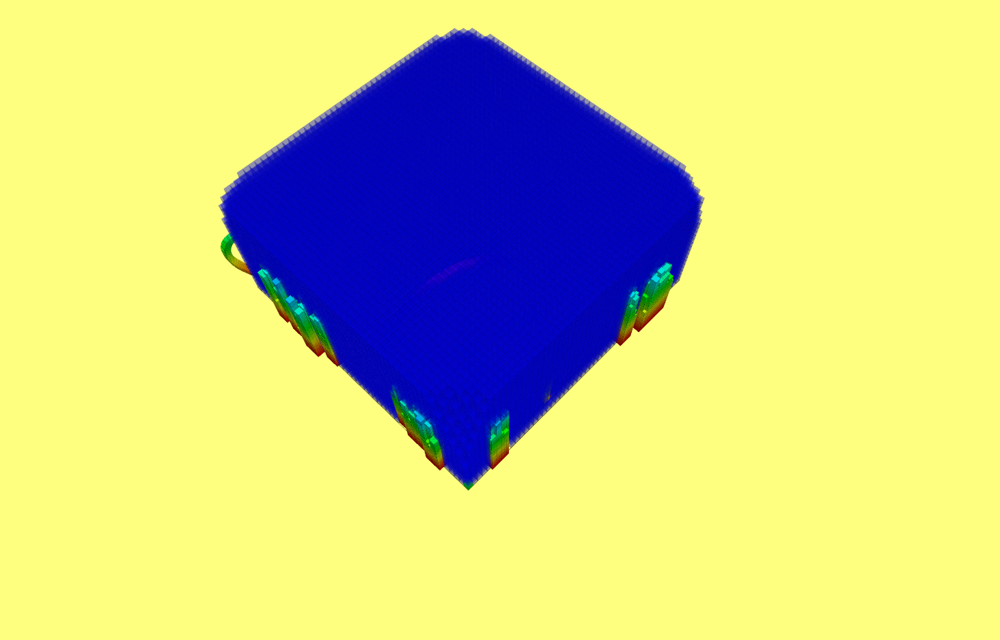
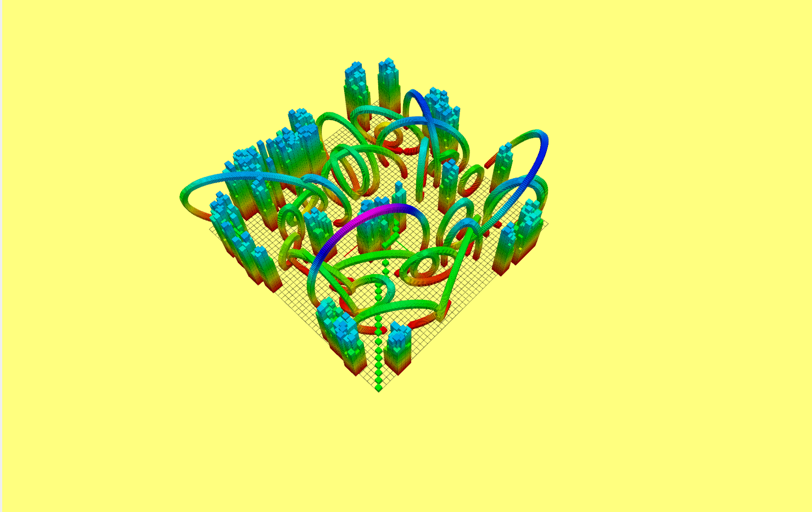
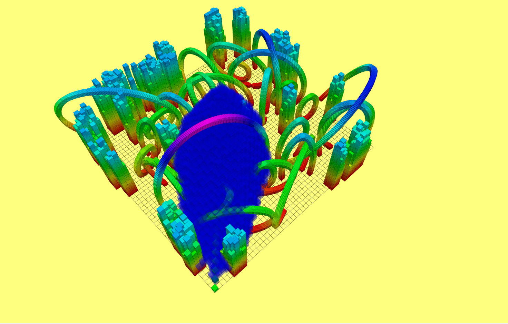
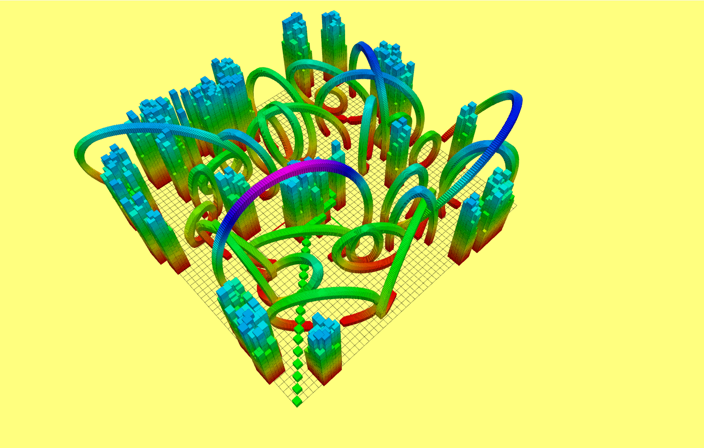
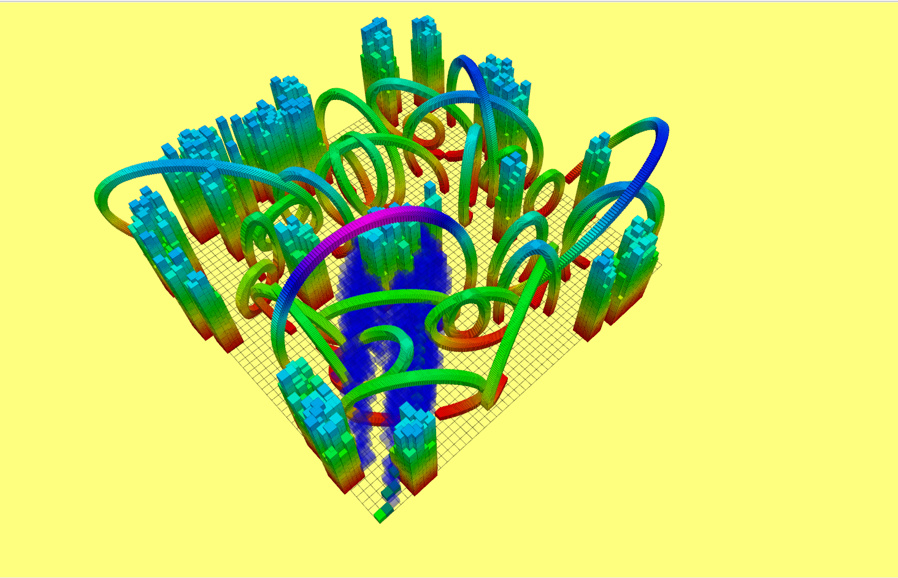
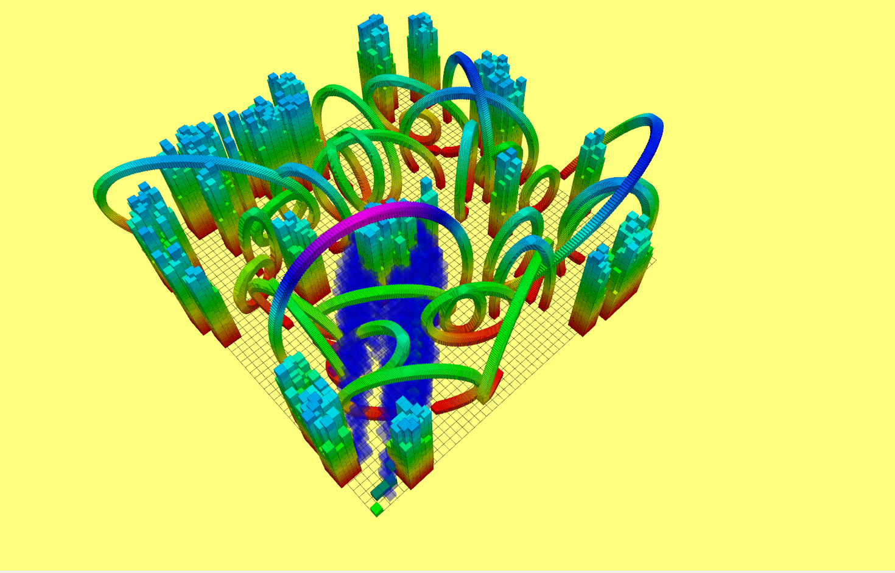

# HW2 work-report about A*

## 1. 算法流程
### 1.1 BFS框架
```cpp
step0. start ----> openSet
Loop until(openSet.top == goal, openSet.empty)
    step1: remove lowest cost node, and add to close set
    step2: expand all neibors of currentNode
    step3: address all neighbors 
        case 1: new node，add to open set
        case 2: in openSet, update open set
        case 3: in closedSet, nothing
End
```
### 1.2 A*框架
```cpp
step0. start ----> openSet
Loop until(openSet.top == goal, openSet.empty)
    step1: remove lowest cost node, and add to close set
    step2: expand all neibors of currentNode
    step3: address all neighbors 
        case 1: new node，add to open set, f = g + h
        case 2: in openSet, update open set, f = g + h
        case 3: in closedSet, nothing
End
```
### 1.3 others
对于评价函数 f = g + h ，g为累积代价，h为启发式代价  
g=0时，退化为贪心策略  
h=0时，退化为Dijkstra算法

## 2. 不同启发函数h对比
最优性保证：$h \le h^*, h=h^*时候是最tight的$
### 2.1 0(Dijkstra)
<div align="center">
    
    
</div>
17.145930 ms, 7.857534 m, 57083 visited

### 2.2 L1Norm(Manhattan)
<div align="center">
    
    
</div>
0.368600 ms, 7.915360 m, 48 visited

### 2.3 L2Norm(Euclidean)
<div align="center">
    
    
</div>
3.280437 ms, 7.857534 m, 1283 visited

### 2.4 infNorm(Chebyshev)
<div align="center">
    
    
</div>
3.463293 ms, 7.857534 m, 7310 visited

### 2.5 Diagonal
我推导的是$h^* = max+(\sqrt{3}-\sqrt{2})min+(\sqrt{2}-\sqrt{1})mid$,  
这个等价于$h^*=(\sqrt{2}-1)\cdot{(dx+dy+dz)}+(2-\sqrt{2})max+(\sqrt{3}-2\sqrt{2}+1)min$  
我实际对比了一下，两个的数值误差$<1^{-14}$，取启发函数$h=h^*$。   
推广：对于 n 维 gridMap中的两个节点坐标$a,b$，$p$为$(a-b)$降序排列，则 $h^*=\sum^n_{i=1}(\sqrt{i}-\sqrt{i-1})*p(i).$  
```cpp
auto p = std::sort(a_b.begin(),a_b.end(),std::greater<int>());
```
<div align="center">
    
</div>

7.857534 m, 203 visited  

课程给的（非最优diag,但是效果好）：$h^*=dx+dy+dz+(\sqrt{3}-3)\cdot min(dx,dy,dz)$，取$h=h^*$
<div align="center">
    
</div>
7.857534 m, 68 visited  

### 2.6 对比
| item \ h | 0 | L2-Norm | inf-Norm | diagonal | class-diagonal | L1-Norm
| - | - | - | - | - | - | - |
| path cost | 7.857534 | 7.857534 | 7.857534 | 7.857534 | 7.857534 | 7.915360 |
| visitd | 57083 | 1283 | 7310| 203 | 68 | 48 | 
| perfermence | 5 | 3 | 4| 2 | 1 | no-optimal but fast | 

## 3. 加入Tie Breaker对比
由于符合最优的路径可能有很多条，可以在启发h里加入一些策略打破这种对称性，朝某一个策略**加速搜索**。
### 3.1 h=L2Norm,加入Tie Breaker
1. $h = l2norm*(1+1^{-10})$
<div align="center">
    
</div>
visited 1281,和没加tie-breaker差不多。可能l2Norm本身离h*就很远，加了一个小的数跟没加差不多。  

2. 在启发里多加一些cross（直线）（贪心）的策略，要求下一个邻居尽可能的在当前节点到终点的连线上    
* $(dx1,dy1)//(dx2,dy2)=> dx1*dy3-dx2*dy1=0$. 越接近零越平行。  
* 对于多维向量，$a//b=>\frac{a\cdot b}{\|a\|\|b\|}=cos0^\degree=1==>a\cdot b-\|a\|\|b\|=0$. 越接近零越平行。  
* $cross=abs(a\cdot b-\|a\|\|b\|), h=h^*+cross*0.001$
<div align="center">
    
</div>
visited 1281,和没加tie-breaker差不多。

### 3.2 疑惑：难道cross-tie-breaker只对 不允许斜向的机器人 起作用？？？？

## 4. 遇到的问题
### 4.1 把启发式函数的实参错误传为了当前节点，应该传为邻居节点。
*在助教的帮助下解决。*
### 4.2 三维Diagonal启发函数问题
自己推导了三维Diagonal启发函数（应该是正确的），见3.1，2。测试效果确实是最优的。  
与class课后作业给出的做了对比，后者多次测试也是最优的，且搜索速度远远快与我推导的。这是什么原因????
### 4.3 在扩展邻居时如果邻居已经在openSet中了，需要更新f和g代价，还需要重新排序吗？
在本次测试中我是重新排序的。

